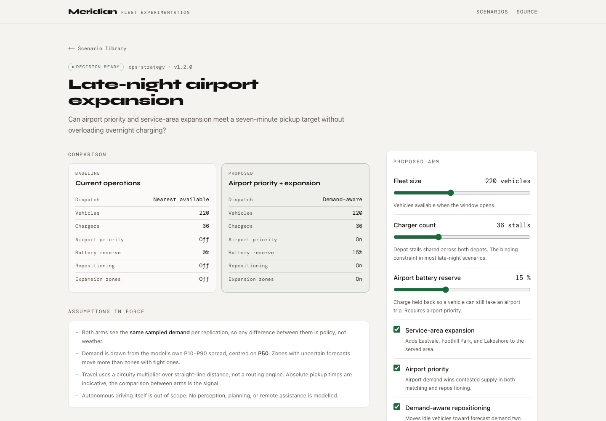
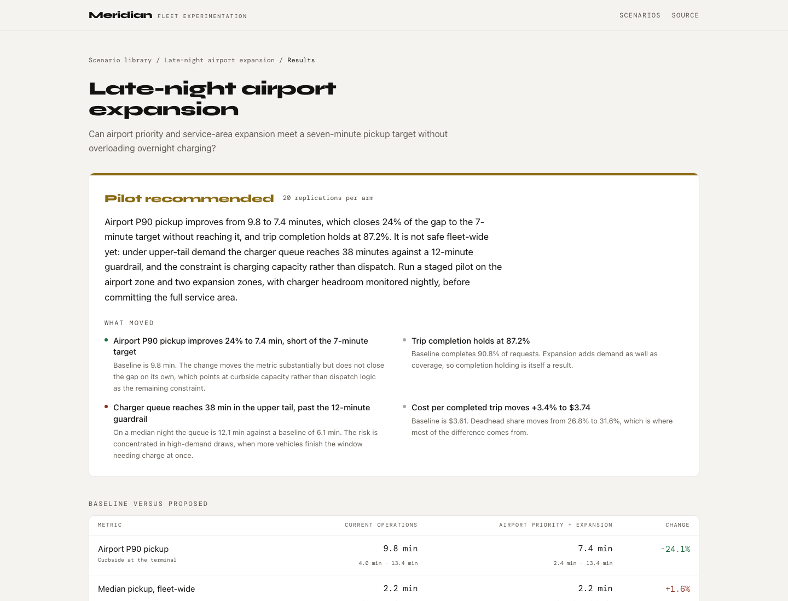
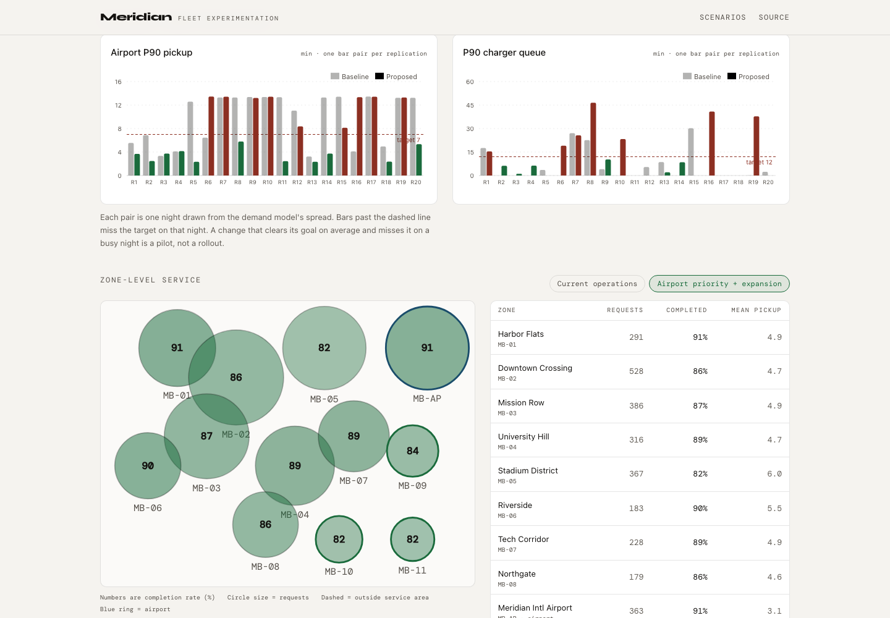
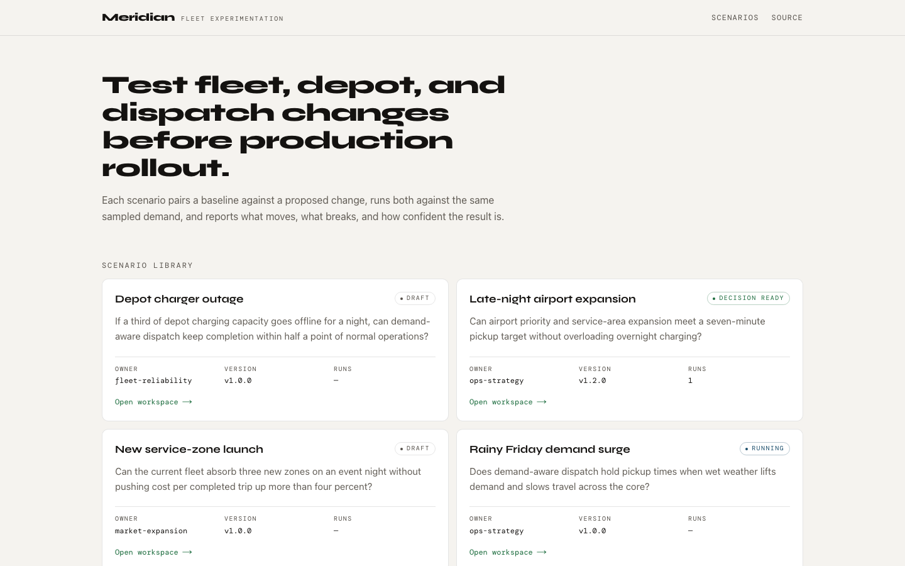

# Meridian

**Test fleet, depot, and dispatch changes against service, cost, and reliability outcomes
before production rollout.**

Meridian explores how operations teams can evaluate fleet-wide changes before production
rollout by combining probabilistic demand forecasting, constraint-aware optimization, and
discrete-event simulation into a self-serve experimentation product.

> **Meridian is fictional.** It is not affiliated with, derived from, or representative of
> any real ride-hail operator, and it uses no proprietary data. Every number it produces
> is **simulated output from synthetic demand**. It is inspired by publicly discussed
> autonomous ride-hail operating challenges, nothing more.

---

## The problem

An operations team wants to expand a service area, change a dispatch policy, or prioritise
airport pickups. The honest answer to "what will that cost us" is usually *it depends on
the night* — and that dependency is exactly what a spreadsheet cannot hold.

Meridian runs the change against many sampled nights, reports the spread rather than a
point estimate, and returns a decision with the reasoning attached: **Recommended**,
**Pilot recommended**, or **Do not launch**.

## The flagship experiment

**Late-night airport expansion** — *Can airport priority and service-area expansion meet a
seven-minute pickup target without overloading overnight charging?*

| | Baseline | Proposed |
|---|---|---|
| Dispatch | Nearest available | Demand-aware (OR-Tools min-cost assignment) |
| Vehicles / depots / chargers | 220 / 2 / 36 | 220 / 2 / 36 |
| Airport priority | Off | On, with a 15% battery reserve |
| Repositioning | Off | On, two intervals of lookahead |
| Service area | Core + airport | Core + airport + 3 expansion zones |

**Simulated result** (20 paired replications, seed `20260214`):

| Metric | Baseline | Proposed | Change |
|---|---|---|---|
| Airport P90 pickup (curbside) | 9.8 min | 7.4 min | **−24%** |
| Trip completion rate | 90.8% | 87.2% | −3.6 pts |
| Completed trips | 2,578 | 2,618 | +41 |
| Deadhead share of miles | 26.8% | 31.6% | +4.8 pts |
| P90 charger queue | 6.1 min | 12.1 min | **+99%** |
| Cost per completed trip | $3.61 | $3.74 | +3.4% |

**Verdict: Pilot recommended.** Airport pickup improves substantially and trip volume
rises, but under upper-tail demand the charger queue breaches its 12-minute guardrail —
and the binding constraint turns out to be charging capacity, not dispatch logic. The
recommendation is a staged pilot on the airport zone and two expansion zones with nightly
charger headroom monitoring, not a fleet-wide launch.

*These are simulated figures from synthetic demand, not observed performance.*

---

## Screenshots

### Experiment workspace
Both arms side by side, assumptions stated on the page, controls that edit only the
proposed arm, and the config source one click away.



### Results and decision
Verdict first, then the metric table where every figure carries its P10–P90 band.



### Uncertainty and zone outcomes
One bar pair per replication, so the spread is the first impression. Zones are a
schematic, not a map, because Meridian Bay is invented.



### Scenario library


---

## Architecture

```
                        experiments/*.yaml
                     (versioned, code-reviewed)
                                 │
                                 ▼
┌──────────────────┐    ┌─────────────────────┐    ┌───────────────────────┐
│  apps/web        │    │ services/simulation │    │ data/models           │
│  Next.js + TS    │───▶│ FastAPI             │───▶│ demand_model.pkl      │
│                  │    │                     │    │ (LightGBM quantile)   │
│  · library       │◀───│  /experiments       │◀───│ + metrics.json        │
│  · workspace     │    │  /validate          │    └───────────────────────┘
│  · results       │    │  /runs              │              ▲
└──────────────────┘    └──────────┬──────────┘   scripts/train_demand_model.py
         ▲                         │
   packages/shared                 ▼
   (TS types mirroring   ┌─────────────────────┐
    the pydantic models) │ per replication:    │
                         │  sample_scenario    │── quantile spread → arrivals
                         │  FleetSim (SimPy)   │── vehicles, chargers, riders
                         │    └ dispatch       │── greedy | OR-Tools
                         │  aggregate → bands  │
                         │  recommend → verdict│
                         └─────────────────────┘
```

Full detail in [`docs/architecture.md`](docs/architecture.md).

| Path | What lives there |
|---|---|
| `apps/web` | Next.js 15 + TypeScript product UI, Recharts for visualisation |
| `services/simulation` | FastAPI service, SimPy engine, OR-Tools dispatch, LightGBM demand model |
| `packages/shared` | TypeScript types mirroring the pydantic config models |
| `experiments/` | Versioned YAML experiment definitions |
| `docs/` | Architecture and assumptions |
| `data/` | Generated history and trained model (gitignored; `make train` recreates) |

---

## Local setup

Requires Python 3.11+ and Node 18+.

```bash
git clone https://github.com/stefenewers/meridian.git
cd meridian

make install     # venv + Python deps + npm workspaces
make train       # generate synthetic history, fit the quantile model (~30s)
```

Then in two terminals:

```bash
make api         # simulation service on http://127.0.0.1:8000
make web         # product UI on http://localhost:3001
```

Copy `.env.example` to `.env` only if you need to change ports.

### Without the UI

```bash
cd services/simulation
./.venv/bin/python scripts/run_experiment.py                       # list experiments
./.venv/bin/python scripts/run_experiment.py late-night-airport-expansion
./.venv/bin/python scripts/evaluate_demand_model.py                # model card
```

### Regenerating the portfolio scenario matrix

The interactive explorer on
[stefenewers.com/projects/meridian](https://www.stefenewers.com/projects/meridian) reads a
precomputed matrix rather than calling a hosted service. Every scenario in it is produced
by this simulation, through `runner.execute`, with `recommend.build` supplying the verdict.

```bash
cd services/simulation
./.venv/bin/python scripts/export_portfolio_scenarios.py \
  --portfolio ../../www.stefenewers.com
```

That writes `data/portfolio/scenarios.json` here and copies it to
`public/meridian/scenarios.json` in the portfolio repo. The exporter validates before it
writes: every control combination present, unique ids, ordered P10–P90 bands, a single
seed, and no non-finite values.

Values are deterministic given the same code, config, model artifact, and seed. To prove
that after a change:

```bash
./.venv/bin/python scripts/export_portfolio_scenarios.py \
  --out /tmp/rerun.json \
  --check-determinism ../../www.stefenewers.com/public/meridian/scenarios.json
```

The matrix is 18 scenarios: charger count (24/36/48) x demand condition (P10/P50/P90) x
dispatch policy (nearest-available/demand-aware). The baseline arm is identical in all of
them, so a visitor only ever changes one side of the comparison.

## Demo flow

1. Open **http://localhost:3001** — the scenario library, four experiments with owners,
   versions, and status.
2. Open **Late-night airport expansion**. Read the two arms and the assumptions in force
   before anything runs. Expand the config source to see the YAML that defines it.
3. Change something in the right-hand rail — drop chargers to 24, or switch the demand
   percentile to **P90** — and press **Run experiment**. Invalid combinations are caught by
   schema validation with field-level errors before a run starts.
4. The results view opens on the verdict. Read the summary, then the metric table where
   every number carries its P10–P90 band, then the per-replication chart where bars past
   the dashed line are nights that missed the target.
5. Toggle the zone schematic between arms to see which zones the change helps and which it
   strains.
6. Check the **Reproducibility** panel. Re-running with the same snapshot and seed
   reproduces those numbers exactly, including on another machine.

---

## Features

- **Probabilistic demand.** LightGBM quantile regressors emit P10/P50/P90 per zone per
  15-minute interval. Holdout P10–P90 coverage is ~77% against a nominal 80%, and the
  training script prints it rather than hiding it.
- **Uncertainty that propagates.** Scenario sampling draws each night's arrivals from the
  model's own fitted spread, so forecast uncertainty reaches the recommendation instead of
  stopping at a chart.
- **Discrete-event simulation.** SimPy models vehicles, trips, battery, depot charging with
  real resource contention, and riders who leave if nobody arrives.
- **Two dispatch policies, head to head.** Greedy nearest-available versus a batched
  min-cost assignment solved with OR-Tools, with airport priority and battery reserve
  encoded as cost rather than hard rules.
- **Paired replications.** Both arms see identical demand draws, so differences are policy,
  not weather.
- **Decision output.** Three verdicts with findings, guardrails, and an executive summary
  in plain language.
- **Reproducible runs.** A run is determined by `(config, seed)` and carries its full
  provenance: input snapshot, policy version, model version, engine version.
- **Versioned experiments.** Definitions are YAML files that move through pull request
  review like the code they test.

## Design decisions

**The recommendation is a rule, not a model.** An operator must be able to read why a
change was called, disagree with a threshold, edit it in the config, and re-run. The
disagreement is nearly always about the target, not the arithmetic.

**"Pilot" is the interesting verdict.** A binary launch/reject is too crude. A change that
moves the primary metric a long way without quite reaching its goal is a pilot candidate —
the goal may be wrong, or the gap may be closable with capacity rather than policy.

**Zones are a schematic, not a map.** Meridian Bay is invented. Drawing it over real
cartography would imply a real market, and a choropleth of a real city would obscure the
thing worth seeing: which zones the change helps and which it strains.

**No metric is a bare point estimate.** Every figure in the product is a mean with a
P10–P90 band, because the finding that matters most in the flagship experiment is that the
proposed arm clears its target on a typical night and breaches a guardrail on a busy one.

**Whether optimisation beats greedy is a question, not an assumption.** Both policies are
first-class and run head to head, because that is what the product exists to test.

## Limitations

Stated in full in [`docs/assumptions.md`](docs/assumptions.md). The ones that matter most:

- **Demand is synthetic.** Metrics measure whether the model learned its own generator,
  not whether it would forecast a real market.
- **No routing engine.** Distance is straight-line times a circuity factor at a single
  average speed. Absolute pickup times are indicative; the arm-to-arm comparison is the
  result.
- **No significance testing.** With 20 replications a small difference between arms is not
  distinguishable from noise, and the product does not yet say so. This is the most
  important missing piece of statistical rigour.
- **Unit economics are illustrative.** Direction is meaningful; the level is arbitrary.
- **Autonomous driving is out of scope** — no perception, planning, or remote assistance.
  Meridian tests the operational envelope those vehicles run inside.
- **Uncalibrated.** No backtest against a known past change exists, so Meridian is
  directionally useful and quantitatively unvalidated.

## Testing

```bash
make test        # 25 tests
make check       # typecheck + lint + tests + production build
```

The suite covers config validation, quantile monotonicity and interval coverage, dispatch
invariants (no double assignment, no flat batteries, rectangular-batch feasibility,
priority behaviour), and end-to-end reproducibility. `tests/test_reproducibility.py` shells
out under two `PYTHONHASHSEED` values, because set-iteration nondeterminism cannot be
caught from inside a single process.

## Links

- **Repository** — https://github.com/stefenewers/meridian
- **Case study** — https://www.stefenewers.com/projects/meridian
- Live demo — not deployed; runs locally in two commands

---

Built by [Stefen Ewers](https://www.stefenewers.com), a software engineer working across TypeScript and Python.
